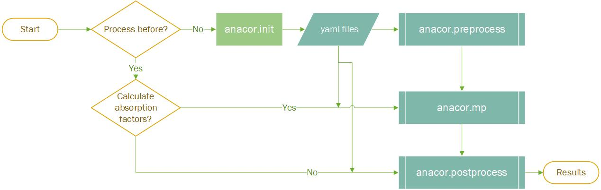
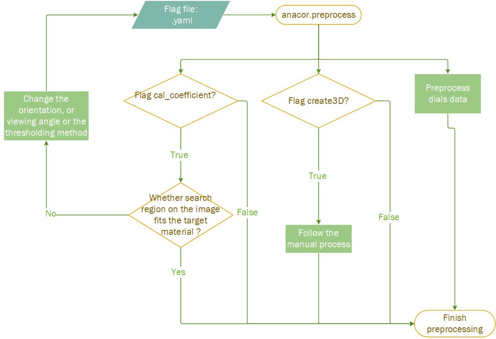

## anacor.init
This command is used to create the initialization for the AnACor. This creates the following three default input files for the user to enter commands/flags to the commands. They contain the possible flags for the anacor.preprocess, anacor.mp. The users can use this template to create a new input file for the commands. **Now the postprocess is also included in the anacor.mp, but you can only run postprocess by `anacor.postprocess`**

```markdown
├── current_folder
│   ├── default_mpprocess_input.yaml
│   ├── default_preprocess_input.yaml
```
There are common options/parameters in the default yaml files, but you can add more based on the detailed documentation below. For example, you don't have GPU and want to use Bisection method, you need to have a row of "gpu: false" and an another row of "bisection: True" in the default_mpprocess_input.yaml.

## anacor.preprocess

This command is used to create 3D model, calculate absorption coefficient and preprocess data from dials (.expt and .refl).  To execute `anacor.preprocess` , the user can either change the flags/parameters in `default_preprocess_input.yaml`  or create a new one .yaml file, where the user needs to source the path like below:

```anacor.preprocess --input-file "input flag file path" ```

### Parameters/Flags in the .yaml file
	"--dataset" ,
	type = str ,
	help = "dataset reference number/name " ,
	
	"--store-dir" ,
	type = str ,
	default = "./" ,
	help = "the store directory " ,
	
	"--segimg-path" ,
	type = str ,
	help = "the path of segmentation images" ,
	
	"--rawimg-path" ,
	type = str ,
	default = None ,
	help = "the path of raw flat-field images" ,
	
	"--refl-filename" ,  
	type = str ,  
	help = "the path of the reflection table" , 
	
	"--expt-filename" ,
	type = str ,
	help = "the path of the experimental file" ,
	
	"--create3D" ,
	type = bool ,
	default = True ,
	help = "whether the reconstruction slices need to be vertically filpped to match that in the real experiment" ,
	
	"--cal_coefficient" ,
	type = bool ,
	default = False ,
	help = "whether need to calculate coefficients" 
	
	"--coefficient-auto-orientation" ,
	type = bool ,
	default = True ,
	help = "whether automatically match the orientation of 3D model with the flat-field image to calculate absorption coefficient "
	
	"--coefficient-auto-viewing" ,
	type = bool ,
	default = True ,
	help = "whether automatically calculating the largest area of the flat-field image to calculate absorption coefficient "
	
	"--coefficient-orientation" ,
	type = int ,
	default = 0 ,
	help = "the orientation offset of the flat-field image to match the 3D model in degree. normally this is 0 degree" ,
	
	"--coefficient-viewing" ,
	type = int ,
	default = 0 ,
	help = "the viewing angle of the 3D model to have the best region to determine absorption coefficient in degree" ,
	
	"--flat-field-name" ,
	type = str ,
	default=None,
	help = "the flat-field image selected to determine the absorption coefficient, "
	"when you use this flag, you should also fill the angle in coefficient_viewing"
	"to allow the 3D model to rotate to match it"
	
	"--coefficient-thresholding" ,
	type = str ,
	default = "otsu" ,
	help = "thresholding method to extract the region of interest"
	"options are: 'triangle', 'li', 'mean,'minimum','otsu','yen','isodata'" ,
	
	"--full-reflection" ,
	type = bool ,
	default = False ,
	help = "whether cutting some unwanted data of the reflection table"
	"before calculating based dials.scale outlier removing algorithm" ,
	
	"--dials-dependancy" ,
	type = str ,
	help = "the path to execute dials package"
	"e.g. module load dials"
	"e.g. source /home/yishun/dials_develop_version/dials" ,
	
	"--model-storepath" ,
	type = str ,
	default = None ,
	help = "the storepath of the 3D model built by other sources in .npy" ,
	
	"--coe_li" ,
	type = float ,
	Optional =True,
	help = "pre-measured absorption coefficient for liquor, if this is given,"
	" liquor will be fixed in this process " ,
	
	"--coe_cr" ,
	type = float ,
	Optional =True,
	help = "pre-measured absorption coefficient for crystal, if this is given,"
	" crystal will be fixed in this process " ,
	
	"--coe_lo" ,
	type = float ,
	Optional =True,
	help = "pre-measured absorption coefficient for loop, if this is given,"
	" loop will be fixed in this process " ,
 
	"--abs_base_cls",
	type=str,
	default='li',
	help="Base class to measure the linear absorption coefficient. "
	     "This class should have an area where only X-rays penetrate this class. "
	     "So the μ = -log(I/I_0) / L"


### Example results on the store directory
```markdown
├── current_folder
|   ├──{dataset}_save_data
│   │   ├──ResultData
	│   │   ├──absorption_coefficient
		│   │   ├──**.png**
	│   │   ├──absorption_factors
	│   │   ├──reflections
	│   │   ├──dials_output
│   │   ├──Logging
│   │   ├──**preprocess_script.sh**
│   │   ├──**{dataset}_.npy**
│   │   ├──** *.expt.json**
│   │   ├──** *.refl.json**
│   ├── default_mpprocess_input.yaml
│   ├── default_preprocess_input.yaml
```

## anacor.mp
This command is used to calculate the absoprtion factors across different nodes on the cluster (Single core command is not optimized yet).  To execute `anacor.mp` , the user can either change the flags/parameters in `default_mpprocess_input.yaml`  or create a new one .yaml file, where the user needs to source the path like below:

```anacor.mp --input-file "input flag file path" ```

### Parameters/Flags in the .yaml file

	"--low",
	type = int,
	help = "The starting point of the batch",

	"--up",
	type = int,
	help = "The ending point of the batch",

	"--store-paths",
	type = int,
	help = "Flag to store paths (1 for true, 0 for false)",

	"--offset",
	type = float,
	help = "Orientation offset value",

	"--dataset",
	type = str,
	help = "Dataset identifier or name",

	"--model-storepath",
	type = str,
	help = "Path to store the full model",

	"--store-dir",
	type = str,
	help = "Directory path for storing output files",

	"--refl-path",
	type = str,
	help = "Path to the reflection data file",

	"--expt-path",
	type = str,
	help = "Path to the experiment data file",

	"--absorption-map",
	type = str2bool,
	help = "Flag to produce an absorption map (True/False)",

	"--map-theta",
	type = int,
	help = "Number of divisions in theta for absorption map",

	"--map-phi",
	type = int,
	help = "Number of divisions in phi for absorption map",

	"--gridding-theta",
	type = int,
	help = "Number of gridding divisions in theta",

	"--gridding-phi",
	type = int,
	help = "Number of gridding divisions in phi",

	"--liac",
	type = float,
	help = "Absorption coefficient of liquor (um-1)",

	"--loac",
	type = float,
	help = "Absorption coefficient of loop (um-1)",

	"--crac",
	type = float,
	help = "Absorption coefficient of crystal (um-1)",

	"--buac",
	type = float,
	help = "Absorption coefficient of other components (um-1)",

	"--sampling-num",
	type = int,
	help = "Number of samples for crystal point calculation",

	"--full-iteration",
	type = int,
	help = "Flag for full iteration (break on encountering an air point)",

	"--pixel-size-x",
	type = float,
	help = "Pixel size in the x dimension of tomography (um)",

	"--pixel-size-y",
	type = float,
	help = "Pixel size in the y dimension of tomography (um)",

	"--pixel-size-z",
	type = float,
	help = "Pixel size in the z dimension of tomography (um)",

	"--openmp",
	type = str2bool,
	help = "Flag to enable OpenMP for computation (True/False)",

	"--gpu",
	type = str2bool,
	help = "Flag to enable GPU computation (True/False)",

	"--single-c",
	type = str2bool,
	help = "Flag to use C for single-threaded computation (True/False)",

	"--slicing",
	type = str,
	help = "Direction for slicing sampling (x, y, or z)",

	"--num-workers",
	type = int,
	help = "Number of worker threads/processes",

	"--test-mode",
	type = str2bool,
	help = "Flag to enable test mode (True/False)",

	"--bisection",
	type = str2bool,
	help = "Flag to activate the bisection method (True/False)",

	"--sampling-method",
	type = str,
	help = "Method for sampling (e.g., 'even', 'random', 'evenrandom')",

	"--sampling-ratio",
	type = float,
	help = "Ratio for sampling (relevant for certain sampling methods)",

	"--gpumethod",
	type = int,
	help = "Method identifier for GPU computation",

	"--gpu-card",
	type = str,
	help = "Type of GPU card used (e.g., 'a100', 'v100')",

	"--gridding",
	type = str2bool,
	help = "Flag to enable gridding (True/False)",

	"--interpolation-method",
	type = str,
	help = "Method for interpolation (e.g., 'linear', 'cubic')",

	"--bisection-py",
	type = str2bool,
	help = "Flag to use Python for bisection method (True/False)",

	"--DEBUG",
	type = str2bool,
	help = "Flag to enable debug mode (True/False)",

	"--gridding-method",
	type = int,
	help = "Method identifier for gridding",

	"--printing",
	type = str2bool,
	help = "Flag to enable printing of output (True/False)",

	"--single-distribution",
	type = str2bool,
	help = "Flag to use a single distribution (True/False)",

	"--inter-method",
	type = str,
	help = "Method for intermediate processing (e.g., 'nearest', 'linear')",

	"--gridding-bisection",
	type = str2bool,
	help = "Flag to enable gridding with bisection (True/False)",

	"--resolution-factor",
	type = float,
	help = "Factor to adjust resolution",

	"--partial-illumination",
	type = str2bool,
	help = "Flag to use partial illumination (True/False)",

	"--centre-point-x",
	type = int,
	help = "Centre point of the beam in the x direction",

	"--centre-point-y",
	type = int,
	help = "Centre point of the beam in the y direction",

	"--centre-point-z",
	type = int,
	help = "Centre point of the beam in the z direction",

	"--beam-width",
	type = int,
	help = "Beam width",

	"--beam-height",
	type = int,
	help = "Beam height",

	"--only-sampling",
	type = str2bool,
	help = "Flag to enable only sampling (True/False)",

	"--load-sampling",
	type = str2bool,
	help = "Flag to enable loading of sampling (True/False)",
	


### Example results on the store directory
```markdown
├── current_folder
|   ├──{dataset}_save_data
│   │   ├──ResultData
	│   │   ├──absorption_coefficient
	│   │   ├──absorption_factors
		│   │   ├──**.json**
	│   │   ├──reflections
	│   │   ├──dials_output
│   │   ├──Logging
│   │   ├──preprocess_script.sh
│   │   ├──**mpprocess_script.sh**
│   │   ├──{dataset}_.npy
│   │   ├──*.expt.json
│   │   ├──*.refl.json
│   ├── default_mpprocess_input.yaml
│   ├── default_preprocess_input.yaml
```
## anacor.post_process
This command is used to combine the calculated absorption factors into dials file and then `dials.scale`.  To execute `anacor.post_process` , the user can either change the flags/parameters in `default_mpprocess_input.yaml`  or create a new .yaml file, where the user needs to source the path like below:

```anacor.post_process --input-file "input flag file path" ```

The results are stored in `{dataset}_save_data/ResultData/dials_output/..`
